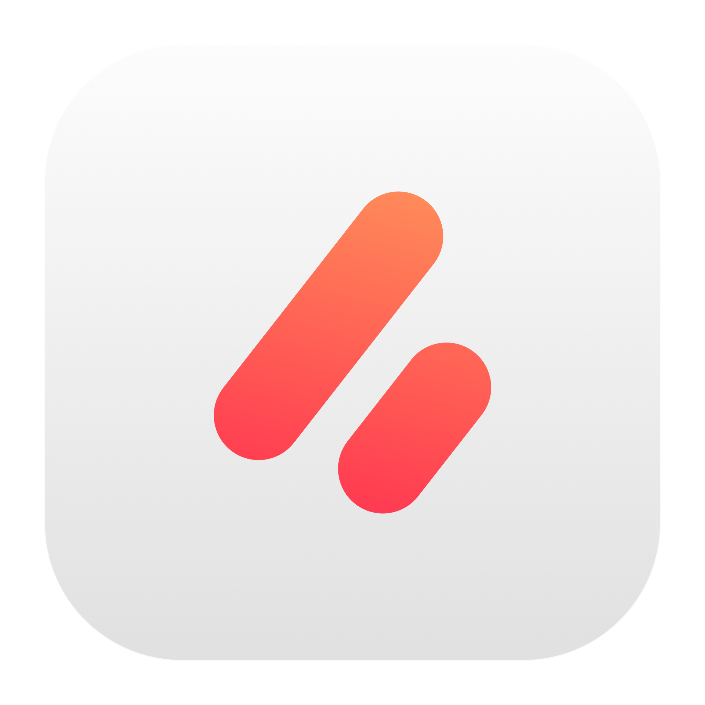
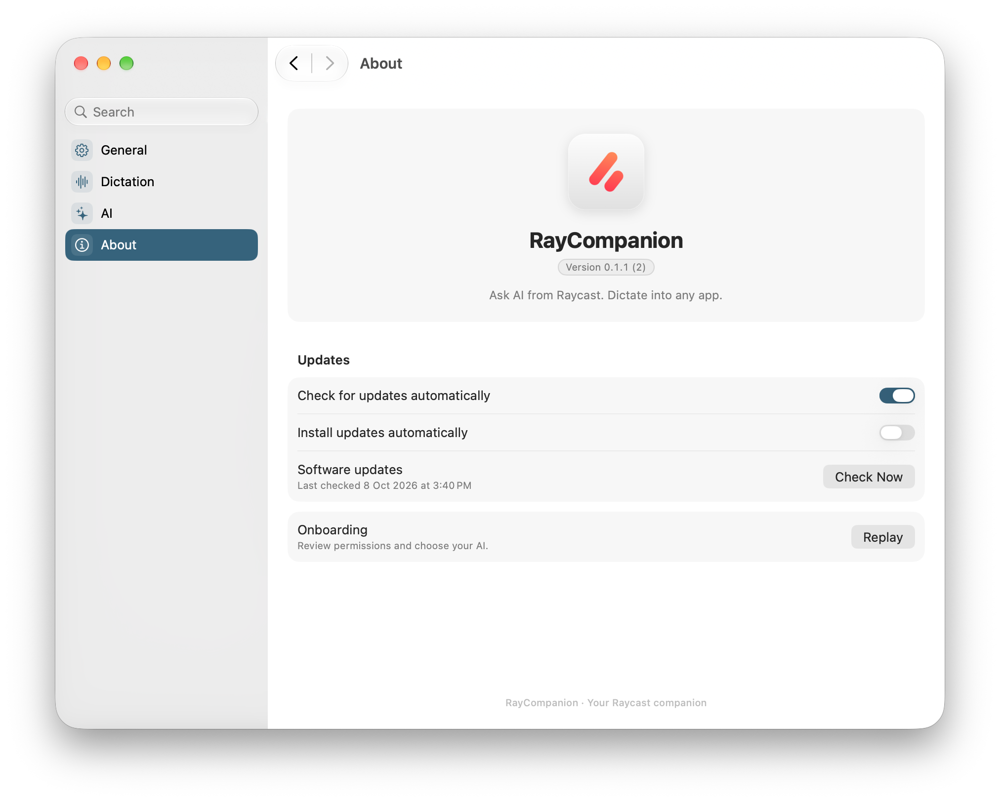

<p align="center"></p>
<h1 align="center">RayCompanion</h1>
<p align="center"><b>Ask AI from Raycast. Dictate into any app.</b></p>
<p align="center">
  
  <a href="https://github.com/techwithanirudh/raycompanion/actions/workflows/ci.yml"></a>
  
</p>
<p align="center"><a href="#features">Features</a> · <a href="#setup">Setup</a> · <a href="#shortcuts">Shortcuts</a> · <a href="#build">Build</a> · <a href="#resources">Resources</a></p>
<p align="center"></p>

## Features

- **Chat from Raycast.** Press Tab to bring your question into chat. Escape returns to Raycast. Open the app for the full chat window.
- **Choose your AI.** Use Apple Intelligence, supported installed AI apps, API providers or MCP tools. API keys stay in Keychain.
- **Dictate locally.** Choose a microphone, shortcut and speech model, then dictate into other apps.
- **Keep your conversations.** Search history, switch models, attach files, and read Markdown and math. The last chat stays open by default.
- **Signed updates.** Sparkle checks for new releases and installs verified updates. About has update preferences and Replay onboarding.

RayCompanion is a separate app, not a Raycast extension or an official Raycast product. Chat requests go directly to the provider you choose. Apple Intelligence and local dictation use their on-device routes.

## Setup

[Download RayCompanion](https://github.com/techwithanirudh/raycompanion/releases/latest/download/RayCompanion.zip), unzip it, and move the app into Applications. Requires macOS 26 and Apple silicon. The current release is self-signed and not notarized; macOS may require approval under Privacy & Security on first launch.

1. Open RayCompanion and follow setup to grant Device Control and Data Access, called Accessibility before macOS 27. You can skip this to use the full chat window.
2. Choose Apple Intelligence, an installed AI app, or your API provider. Provider setup stays inside onboarding.
3. Open Raycast, type your question, and press Tab.
4. To use dictation, enable it in Dictation settings, grant Microphone access, and download a speech model.

Press Tab with an empty Raycast search to reopen chat. Opening the app manually shows the full chat window. Login startup stays in the background. If setup is unfinished, reopening returns to that step.

For Exa search, enter your key under AI's Exa search section. It uses the existing MCP tools with Keychain storage. A model that supports tools is required; Apple Intelligence does not use this route.

## Shortcuts

| Shortcut | Action |
| --- | --- |
| Tab at Raycast root | Open inline chat |
| Escape | Return to Raycast or go back within a menu |
| ⌘K | Actions |
| ⌘Y | Chat history |
| ⌘J | Continue in the full chat window |
| ⌘N | New chat |
| ⌘⇧C | Copy the last response |
| ⌘, | Settings |
| ⌘W | Close the current window |

## Build

Use Swift 6 and the macOS 26 SDK. The project builds with SwiftPM; no Xcode project is required.

```sh
./scripts/check.sh
./scripts/build-app.sh
open build/RayCompanion.app
```

| Path | What lives there |
| --- | --- |
| `Sources/RayCompanion` | App lifecycle, menus, onboarding and Raycast integration |
| `Sources/TinycastKit` | Native AI, dictation, settings, Sparkle and shared upstream components |
| `Sources/ChatCore` | Prompt gating, dismissal state and small transport/storage models |
| `Sources/DictationHelper` | Separate local speech worker |
| `Checks`, `Tests` | AI, provider, Markdown and core checks |

The bundle identifier `com.anirudh.quickchat` stays stable to preserve history, Keychain and permission approval. The executable and displayed app name are RayCompanion. Unrelated launcher screens and old settings editors were removed; remaining shared dependencies are documented in the cleanup review.

Release builds use `./scripts/release.sh`. The archive and appcast are signed with the release key in Keychain. GitHub Releases serves both; no API token ships in the app. See [release instructions](docs/RELEASING.md).

## Verification

The local suite has 305 chat checks, 790 provider checks, 45 Markdown checks and seven core tests. The user confirmed physical Tab delivery, normal typing and Escape. A later intermittent dismissal report has a new readiness retry fix; physical confirmation of that fix is pending. The signed public release passed a real Sparkle download, installation and relaunch test. Desktop checks cover native settings, onboarding and provider setup. Authenticated Exa search still needs a user key for end-to-end verification.

UI checks use a separate app bundle. The production app has no canned response provider. The Raycast hook consumes only plain Tab at root and does not synthesize normal typing. Modifier-only shortcut hooks remain disabled.

## Resources

- [Architecture](docs/ARCHITECTURE.md)
- [Releases](docs/RELEASING.md)
- [Tinycast integration](docs/TINYCAST.md)
- [Cleanup review](docs/CLEANUP.md)
- [Remotely reference](docs/REMOTELY.md)
- [Outstanding work](TODO.md)

## License

Based on [Tinycast](https://github.com/abue-ammar/tinycast), with adapted MIT onboarding components from [Remotely](https://github.com/techwithanirudh/remotely). The copied Tinycast source is AGPL-3.0. Upstream notices and asset terms remain in [docs/licenses](docs/licenses) and the app bundle. See [LICENSE](LICENSE).
