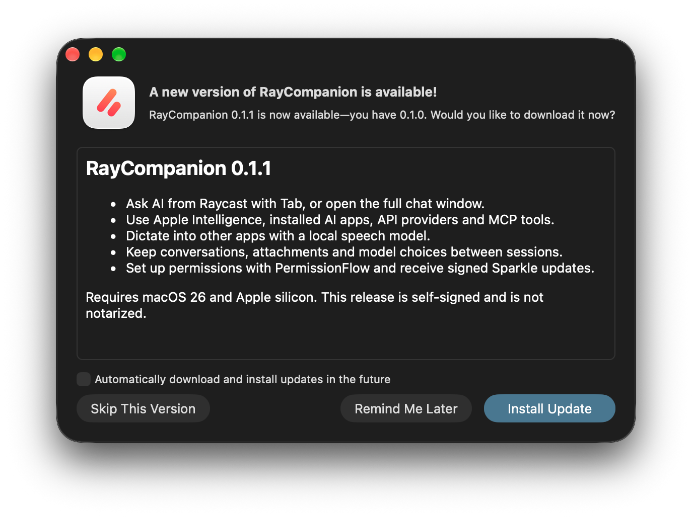

# Releases

| What | Location |
| --- | --- |
| Signed appcast | `https://github.com/techwithanirudh/raycompanion/releases/latest/download/appcast.xml` |
| Update archive | `https://github.com/techwithanirudh/raycompanion/releases/download/v<VERSION>/RayCompanion.zip` |
| Signing key | Login Keychain, account `com.anirudh.raycompanion.updates` |

Sparkle 2.10.0 downloads the archive, verifies its Ed25519 signature before extraction, and installs it. The app also requires a signed feed. Update preferences and the last-check date appear in About.

## Prepare a release

1. Increment both versions in `Resources/Info.plist`. `CFBundleVersion` must increase for existing installations to receive the update.
2. Update `Resources/ReleaseNotes.md` and `Resources/ReleaseNotes.html`.
3. Run `./scripts/release.sh`. It runs the checks, builds the app in release mode, verifies code signing, archives with `ditto`, and generates and verifies the signed appcast.
4. Verify the resulting build on the desktop and commit the source when ready.
5. Run `./scripts/release.sh --publish` to publish the archive and appcast together. The script requires a clean working tree.

Every release contains its complete feed at the same stable `latest/download` address. Archive URLs point to the versioned release. Do not delete published releases that existing feeds reference.

The release script reads the signing key directly from Keychain. It never writes the private key into the repository, a fixture or a log. A fresh machine needs the signing key and the same code-signing identity before it can publish compatible updates. Do not regenerate either identity for an existing app.

## Signing

The public key is `SUPublicEDKey` in `Resources/Info.plist`. Generate or inspect it with Sparkle's official `generate_keys --account com.anirudh.raycompanion.updates` tool. The script checks that it matches the app before signing an archive.

Local releases currently use the stable `Remotely Self Signed` code-signing identity. This preserves Accessibility approval across updates, but it is not Developer ID signing or notarization. First installations may require approval in macOS Privacy & Security. The release script rejects ad-hoc signatures. CI's unsigned development artifact is separate from a release.

Read [Sparkle's publishing documentation](https://sparkle-project.org/documentation/publishing/) before changing feed generation or archive hosting.

## Verified first release

The public v0.1.1 feed and archive downloaded anonymously. Sparkle verified the signed feed, offered version 0.1.1 to an isolated copy set to build 1, downloaded the archive, installed build 2, and relaunched. The installed executable matched the release build by SHA-256, and its code signature passed verification. The normal installed app was restored afterward.

